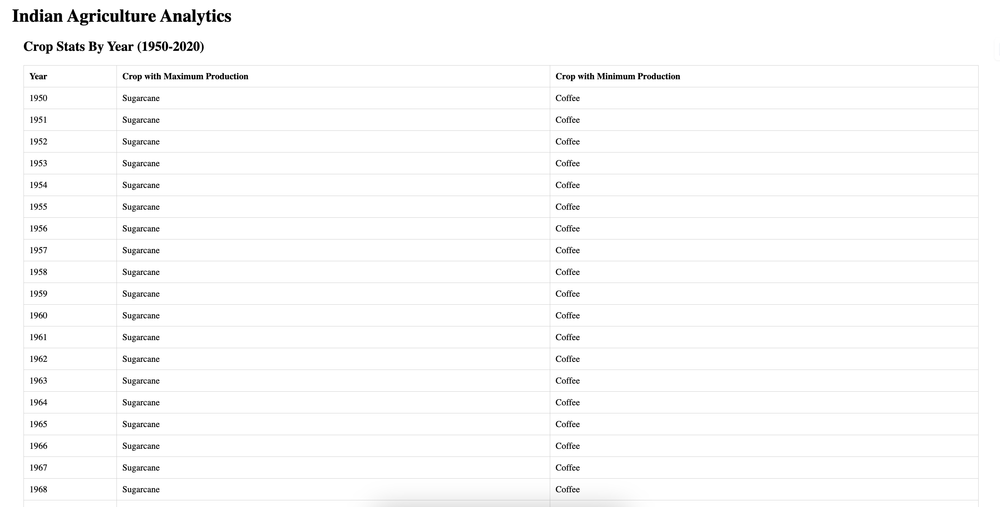
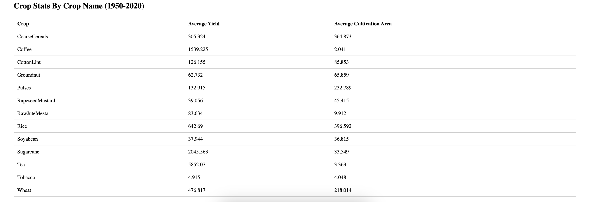

## Screenshots

### Table 1


### Table 2


Assignment by Utkarsh Bhardwaj (https://www.linkedin.com/in/utkkkarshhh | utkarshbhardwajmail@gmail.com | https://utkarshbhardwaj.vercel.app/)

## Installation

To install the project, run:

```bash
yarn install
```
## Start

```bash 
yarn start
```

